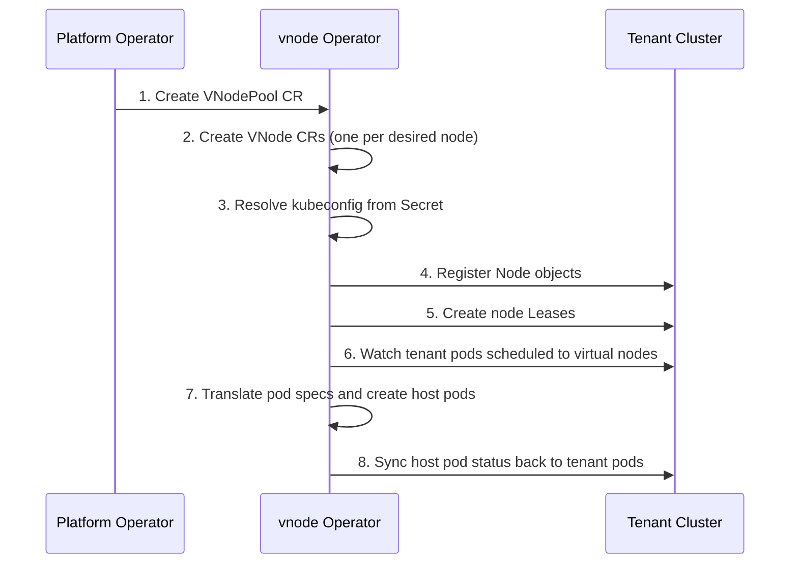
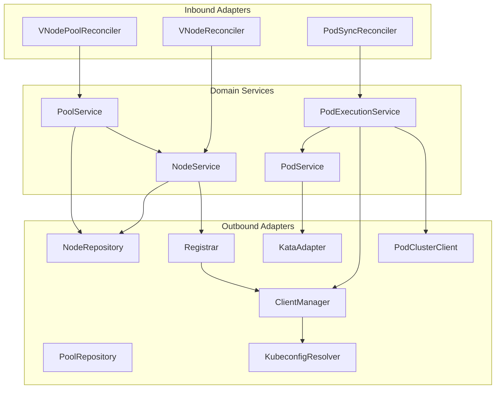

# vnode

`vnode` is an open-source Kubernetes operator for building virtual node pools for virtual clusters.

It is designed for platform builders who want to offer isolated Kubernetes capacity to multiple tenants without provisioning a dedicated VM for every node in every cluster.

## What vnode is

- A CRD-driven operator that manages virtual node pools.
- A control plane for registering virtual nodes inside a target cluster.
- A translation layer that maps tenant-scheduled pods to workloads on a host cluster.
- A way to combine Kubernetes-native scheduling with stronger isolation backends such as Kata Containers.

## What vnode is not

- Not a custom container runtime.
- Not a patched `containerd` distribution.
- Not tied to a single cloud provider, datacenter, or network design.
- Not a hosted product.

## Problem

Virtual clusters are cheap to create, but node-based tenancy is still expensive if every tenant needs dedicated worker VMs.

`vnode` aims to close that gap by letting a platform operator expose virtual nodes inside a tenant cluster while deciding how workloads are placed and isolated on the underlying host cluster.

## Goals

- Per-tenant virtual node pools.
- Support for shared, dedicated, and hybrid pool policies.
- Strong workload isolation through pluggable runtimes.
- Clean lifecycle management with Kubernetes-native APIs.
- Generic primitives that can be mapped to many product or pricing models.

## How it works

### Lifecycle overview



### Step by step

1. **VNodePool creation** — A platform component (e.g., a provisioning worker) creates a `VNodePool` custom resource in the host cluster. The pool references a tenant vcluster via a kubeconfig Secret and declares the desired node count, per-node capacity, pool mode, and isolation backend.

2. **VNode provisioning** — The VNodePool reconciler calls the PoolService, which calculates the desired scale actions. For each node to add, the NodeService creates a `VNode` CR and registers it as a real Node object inside the tenant cluster.

3. **Kubeconfig resolution** — The operator reads the tenant kubeconfig from a Kubernetes Secret (referenced by the VNodePool's `tenantRef.kubeconfigSecret`). The kubeconfig must point to the vcluster API server using an in-cluster service URL (e.g., `https://<name>.<namespace>.svc.cluster.local:443`).

4. **Tenant node registration** — The Registrar adapter connects to the tenant cluster and creates:
   - A `Node` object with the virtual node's advertised capacity, labels (`vnode.kroderdev.io/managed: true`), and any configured taints.
   - A `Lease` in the `kube-node-lease` namespace to signal node liveness (40s duration).

5. **VNode self-healing** — Each VNode reconciler watches its own CR. If a node is `Pending` or `NotReady`, it requeues itself every 2 seconds to retry registration. Once ready, it stops requeuing. Phase transitions on VNodes trigger a pool reconcile to update the pool's ready count.

6. **Pod translation** — The PodSync reconciler watches VNodePools and lists tenant pods scheduled to ready virtual nodes. For each pod, it:
   - Strips vcluster-injected service account volumes.
   - Applies the configured `RuntimeClassName` (if set) for workload isolation.
   - Adds tracking labels (`app.kubernetes.io/managed-by: kroderdev-vnode`, pool name, node name, source pod info).
   - Applies node selector constraints for dedicated/burstable pool modes.
   - Creates or updates the translated pod on the host cluster.

7. **Status sync** — Host pod status (phase, IP, container statuses) is continuously synced back to the corresponding tenant pod so `kubectl get pods` in the tenant cluster shows accurate state.

8. **Cleanup** — When a VNodePool is deleted, the finalizer (`vnode.kroderdev.io/pool-cleanup`) ensures all VNodes are deregistered from the tenant cluster, all managed host pods are deleted, and all VNode CRs are removed before the pool is finalized.

### Reconciler architecture

The operator runs three independent controllers:

| Controller | Watches | Triggers on | Responsibility |
|---|---|---|---|
| **VNodePool** | `VNodePool`, `VNode` | Pool spec changes (generation), VNode phase transitions | Scale nodes up/down, update pool status |
| **VNode** | `VNode` | Any VNode change | Register/update node in tenant cluster, self-heal |
| **PodSync** | `VNodePool` | Pool changes | Translate tenant pods to host pods, sync status |

## API model

### VNodePool

```yaml
apiVersion: vnode.kroderdev.io/v1alpha1
kind: VNodePool
metadata:
  name: my-pool
  namespace: vcluster-tenant-a
spec:
  tenantRef:
    vclusterName: tenant-a
    vclusterNamespace: vcluster-tenant-a
    kubeconfigSecret: tenant-a-vnode-kubeconfig
  nodeCount: 3
  perNodeResources:
    cpu: "4"
    memory: 8Gi
    pods: 110
  mode: shared           # shared | dedicated | burstable
  isolationBackend: kata # RuntimeClass name for pod isolation
status:
  phase: Ready           # Pending | Ready | Scaling | Failed | Deleting
  readyNodes: 3
  totalNodes: 3
  conditions:
    - type: Ready
      status: "True"
    - type: Degraded
      status: "False"
    - type: PodExecutionReady
      status: "True"
```

### VNode

```yaml
apiVersion: vnode.kroderdev.io/v1alpha1
kind: VNode
metadata:
  name: my-pool-1
  namespace: vcluster-tenant-a
  labels:
    vnode.kroderdev.io/pool: my-pool
  annotations:
    vnode.kroderdev.io/vcluster-name: tenant-a
    vnode.kroderdev.io/vcluster-namespace: vcluster-tenant-a
    vnode.kroderdev.io/kubeconfig-secret: tenant-a-vnode-kubeconfig
spec:
  poolRef: my-pool
  capacity:
    cpu: "4"
    memory: 8Gi
    pods: 110
status:
  phase: Ready           # Pending | Ready | NotReady | Terminating
  conditions:
    - type: KubeconfigResolved
    - type: Registered
    - type: Ready
    - type: Degraded
```

## Architecture



The project follows hexagonal architecture (ports and adapters). The domain layer defines interfaces (`ports/`) that are implemented by adapters. Domain services never import Kubernetes types directly.

## Isolation model

`vnode` does not provide isolation by itself. It relies on isolation backends already installed in the host cluster.

Examples:

- Kata Containers
- gVisor
- other runtime-backed sandboxing strategies

The current default direction is to use Kata for stronger tenant boundaries when running on shared infrastructure. The `isolationBackend` field in the VNodePool spec maps directly to a Kubernetes `RuntimeClass` name.

## Configuration

The operator is configured via environment variables:

| Variable | Default | Description |
|---|---|---|
| `METRICS_ADDR` | `:8080` | Prometheus metrics endpoint |
| `HEALTH_PROBE_ADDR` | `:8081` | Health and readiness probes |
| `LEADER_ELECTION` | `false` | Enable leader election for HA deployments |
| `DEFAULT_RUNTIME_CLASS` | _(empty)_ | Default RuntimeClass for pod isolation (e.g. `kata`, `gvisor`) |
| `HOST_NAMESPACE` | `vnode-system` | Host namespace for operator resources |

## Observability

### Prometheus metrics

| Metric | Type | Description |
|---|---|---|
| `vnode_host_pod_creates_total` | Counter | Host pods created, by pool |
| `vnode_host_pod_deletes_total` | Counter | Host pods deleted, by pool |
| `vnode_pod_status_sync_total` | Counter | Pod status syncs, by pool |
| `vnode_pod_execution_failures_total` | Counter | Execution failures, by pool |

### Kubernetes events

Events are recorded on VNodePool resources:

- `PodExecutionSynced` (Normal) — pod sync completed successfully
- `PodExecutionFailed` (Warning) — pod sync encountered errors
- `PodCleanupComplete` (Normal) — orphaned host pods cleaned up
- `PodCleanupFailed` (Warning) — cleanup encountered errors

### Status conditions

**VNodePool conditions:** `Ready`, `Degraded`, `PodExecutionReady`

**VNode conditions:** `KubeconfigResolved`, `Registered`, `Ready`, `LeaseActive`, `Degraded`

## Project status

`vnode` is under active development.

What exists today:

- CRD types for `VNodePool` and `VNode`
- reconciliation flow for pool and node objects
- real target-cluster node registration from kubeconfig secrets
- target-cluster lease creation and cleanup
- translated host pod creation from tenant-scheduled pods
- host pod status sync back into tenant pods
- pool and pod execution conditions, events, and metrics
- domain model and service layer with unit and end-to-end tests
- runtime adapter abstraction

What is still being completed:

- host pod drift reconciliation is being tightened so source spec changes trigger safe host pod replacement
- stronger retry, conflict, and shutdown handling around status updates
- production-grade placement, cleanup, autoscaling, and installation packaging

## Design principles

- Kubernetes-native first
- no host mutation as a core requirement of the project itself
- separation between infrastructure primitives and product plans
- pluggable isolation and placement strategies
- honest status reporting over hidden magic

## Non-goals

- Building a proprietary all-in-one runtime stack
- Embedding billing or provider-specific commercial logic in the operator API
- Requiring a specific CNI, ingress, or datacenter topology

## Repository layout

```text
api/v1alpha1/              CRD type definitions
cmd/vnode/                 main entrypoint
e2e/                       end-to-end tests
internal/
  adapter/
    inbound/reconciler/    Kubernetes controllers
    outbound/
      kubeclient/          Kubernetes API adapters
      virtualkubelet/      tenant cluster registration
      runtime/             isolation runtime (Kata)
  config/                  operator configuration
  domain/
    model/                 domain entities
    ports/                 interfaces (inbound + outbound)
    service/               application/domain services
  observability/           Prometheus metrics
```

## Development

Build and test locally:

```bash
make test       # unit tests
make test-e2e   # end-to-end tests with envtest
make build      # build binary to bin/
make docker     # build Docker image
make lint       # run linter
make generate   # generate deepcopy code
make manifests  # generate CRD manifests
make install    # apply CRDs to cluster
```

## Roadmap

See [ROADMAP.md](ROADMAP.md).

The short version:

1. Finish spec drift replacement behavior and shutdown-safe status reconciliation.
2. Add placement and lifecycle safety for shared and dedicated pools.
3. Add autoscaling and admission policy.
4. Harden installation, RBAC, and operational docs.

## License

Apache 2.0. See [LICENSE](LICENSE).
